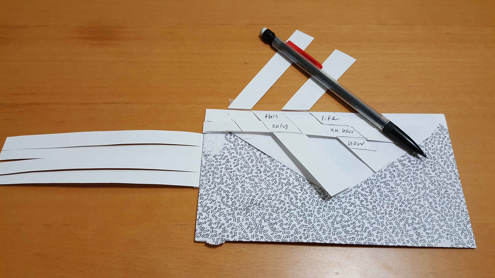

### Back of the Envelope

Written on flattened envelopes and scraps of paper, the effect of Emily Dickinson's "envelope poems" depends as much on visual shape as on words. This puzzle explores the unique difficulties of reading the envelope poems, asking solvers to engage with the materiality of Dickinson's poetry as well as the intricate linkages imagined by her language. 

By folding down strips of verse in the correct order, puzzle solvers "weave" a facsimile-like manuscript. As solvers layer the strips, they may discover blank spaces or an alternative word that appears in line 2 of the manuscript: making the poem visible requires solvers to think about the process of composition, as well as to spend more time with a short and easily overlooked piece.

