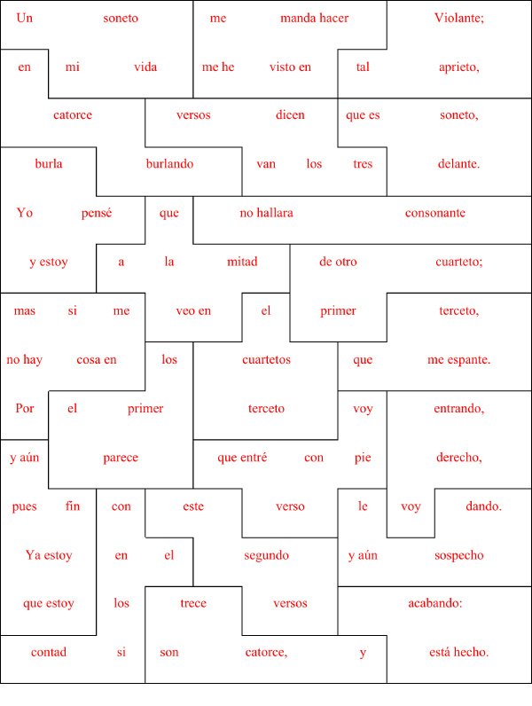

### Soneto de Repente

As a proof of concept, Meghan Depue created a paper puzzle version of Lope de Vega’s _Soneto de repente_, a Spanish sonnet, the title of which translates as "Sonnet All of a Sudden." Taken from the play _La niña de plata_, this "metasonnet" (the subject of which is the sonnet form) is spontaneously composed by a character trying to prove his worth as a poet. Thoroughly self-reflexive in form and content, the first line of the first tercet reads "Por el primer terceto voy entrando," which translates as “Through the first tercet I am entering”. 

Importantly, some design specifications for this Spanish sonnet differ from those used for the group's English sonnet puzzles. Each of the twenty-two puzzle pieces shown below is a heptomino (containing seven syllables). This piecification of Lope de Vega's sonnet results because every line of verse contains eleven syllables, a measure which required an 11 x 14 puzzle grid (as opposed to the 10 x 14 grid of an English sonnet). A complicated prosodic scheme allows Spanish sonneteers to break or combine syllables as necessary to achieve these eleven-syllable lines, and that can make counting syllables while trying to solve this puzzle more challenging. 

A first reading of Lope de Vega’s poem makes the connection between the inner workings and the surface meaning apparent, but in its remediation as a puzzle the connection becomes more obvious still. More than any of other puzzle poem fabricated by the group, these puzzle pieces signal their position and guide the fluent in solving the puzzle. In fact, Depue imagines a classroom use case for the poem: completing the puzzle, solvers are involved in the poem's playful way with structure and content and more greatly appreciate the Lope de Vega's irony.
