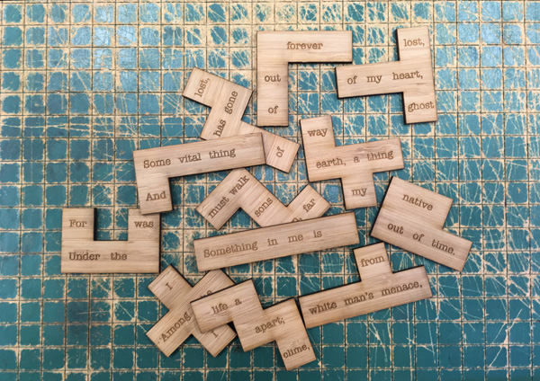

### Claude McKay, "Outcast"

Brad Pasanek found in _Harlem Shadows_ (1922) a Claude McKay sonnet that [piecifies](https://bpasanek.github.io/puzzlepoesis/fabrication/2017/07/14/Recipe.html) and fabricated two sestet puzzles in bamboo. 

The poem is McKay's "Outcast," a sonnet that seems to thematize the misfitting of identity and form in its placing of 
"forgotten jungle songs" (line 3) within an English verse form. 

As an eighteenth-centuryist, I/Brad can't help note what look like allusions to Phyllis Wheatley (her neoclassical "native clime") alongside the play of other "unheard melodies." But McKay's modern verses are more adamantly homesick and therefore more characteristically Modernist. More explicit and forthright, too. McKay's naming of "the white man's menace" condemns the cause of the fundamental rift in the closing couplet.

Our puzzle makes most plain (perhaps even too patent) the poem's structuring volta. An English sonnet, a Jamaican-American poet: 
"Outcast" divides sharply into a nostalgic octave and an alienated sestet, an African past and a Harlem Renaissance present. 

The politics of the puzzle allow the solver to work at integration. But its moral, if puzzles can have morals, is more radical. In a word, racism is structural. Reparation and reconciliation are still blocked by the menace of a white supremacy that must be overcome. 

Read McKay's full sonnet below: 

**OUTCAST**  

For the dim regions whence my fathers came  
My spirit, bondaged by the body, longs.  
Words felt, but never heard, my lips would frame;  
My soul would sing forgotten jungle songs.  
I would go back to darkness and to peace,  
But the great western world holds me in fee,  
And I may never hope for full release  
While to its alien gods I bend my knee.  
Something in me is lost, forever lost,  
Some vital thing has gone out of my heart,  
And I must walk the way of life a ghost  
Among the sons of earth, a thing apart;  
For I was born, far from my native clime,  
Under the white man’s menace, out of time.  

&nbsp; &nbsp; &nbsp; -- from _Harlem Shadows_ (New York: Harcourt, Brace and Company, 1922), p. [45](https://books.google.com/books?id=aKTPAAAAMAAJ&pg=PA45#v=onepage&q&f=false).
