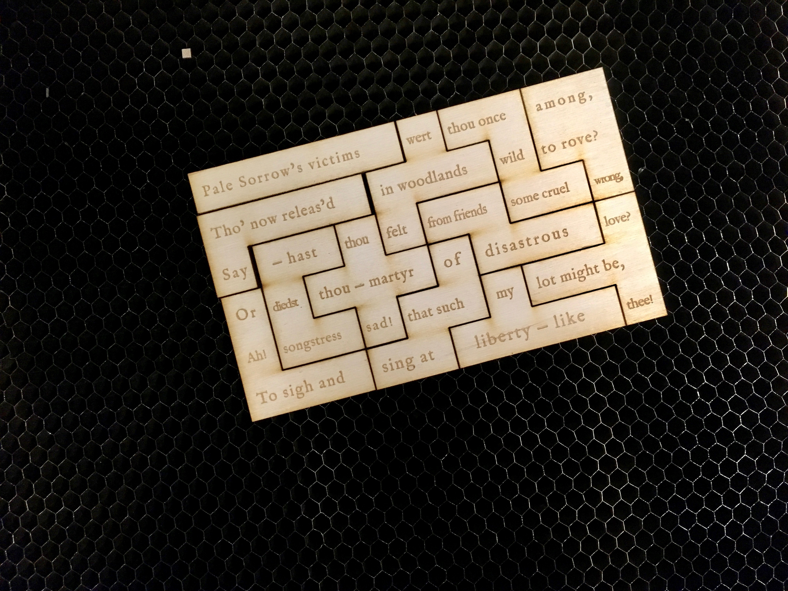

### Sonnet III. To a Nightingale

Neal Curtis and Brad Pasanek designed and cut five new sestets to give away to colleagues at ASECS 2018. One is shown below, freshly engraved and cut, still warm on the laser cutter's bed.

Read Smith's full sonnet [here](https://quod.lib.umich.edu/e/evans/N22357.0001.001/1:10.3?rgn=div2;view=fulltext).
