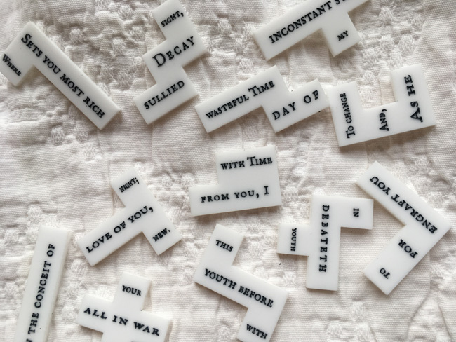

<h1>{{ site.title | default: site.github.repository_name }}</h1>

{{ site.description | default: site.github.project_tagline }}

 

 

You have arrived at the home of UVA's Puzzle Poetry working group, launched in the fall of 2017 by Neal Curtis and Brad Pasanek as an experimental and collaborative endeavor. We treat poems as puzzles, isolate the substance of prosody, and apprehend shape as a medium. Ours is a motley and interdisciplinary collective that calls upon far-flung University resources: laser cutters, 3D printers, cluster computing service units, art and architecture studios. We are makers, coders, and subformalists. We are interested in overcoming constraint.

Several of our efforts are documented in these pages. Follow us on [Instagram](https://www.instagram.com/puzzlepoesis/). More puzzle projects are forthcoming...

<!--

#### Core Participants
<ul>

<li>
    <a href="people/{{people.lastname}}-{{people.firstname}}.html">{{ people.firstname }} {{ people.lastname }}</a>, 
    
        {{ people.affiliations.dept }}
    </li>

</ul>
-->
